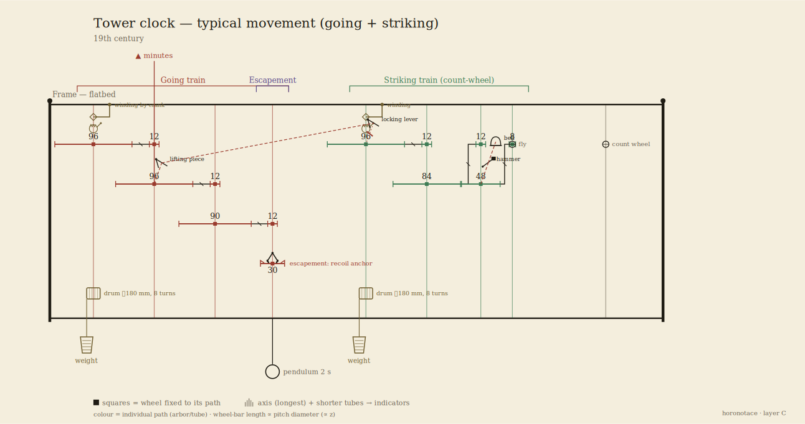
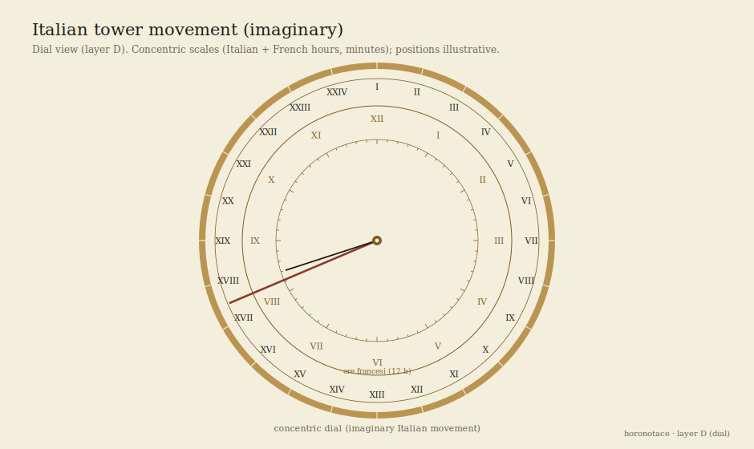
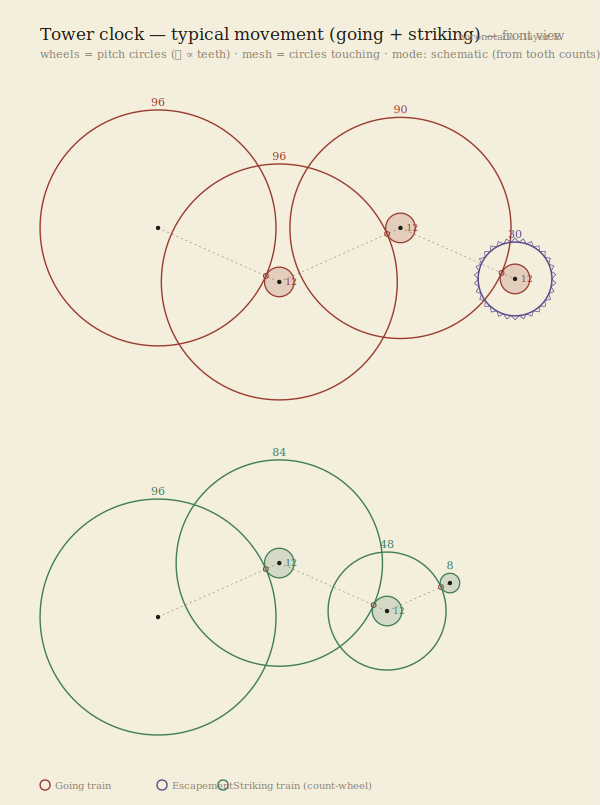
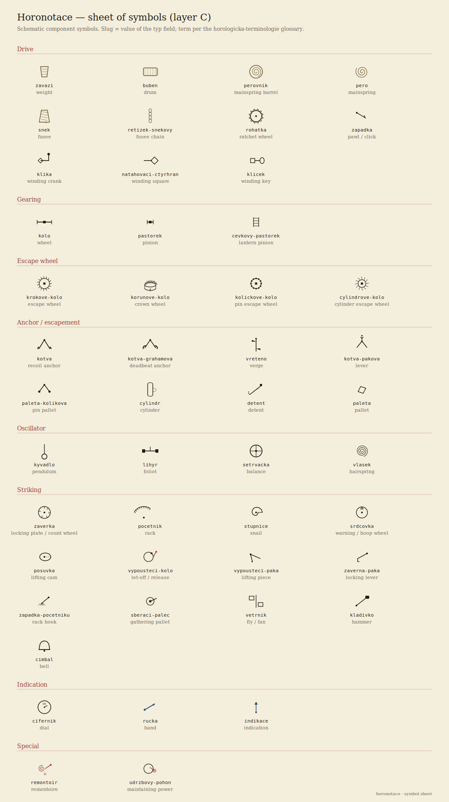
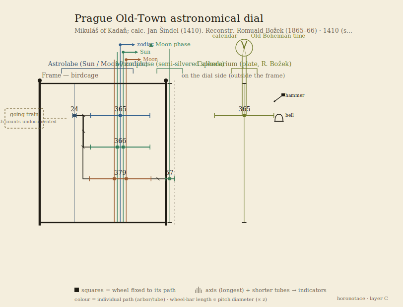

# Horonotace — a notation for describing clock movements

*[Čeština](specifikace.md) · English*

### Specification v0.1 · working draft for review

| | |
|---|---|
| **Status** | Draft — for expert review |
| **Date** | 22 June 2026 |
| **Author** | David Knespl (Czech Horological Society) |
| **Intended for** | conservators, museum curators, clockmakers and researchers, for comment |
| **Contact for comments** | see §14 |

---

## 0. Summary for the hurried

**Horonotace** is a proposed way to **record an entire clock movement in a uniform,
machine-readable form** — drive, gear train, escapement, oscillator, striking work,
indication elements — so that from the same record one can:

1. **draw a schematic diagram** of the movement (a kinematic diagram) as well as a front
   view of the dial,
2. **compute** the gear ratio, the beat count, and where applicable the error of an
   astronomical indication,
3. **cite** it in scholarly text and store it in a collections database.

The goal is something like "musical notation" or a "chemical formula" for clock
movements: an unambiguous, economical and shareable description that today is **missing**
(§3).

**What we need from you:** please review in particular the **terminology** (§9), the
**faithfulness of the construction description** (§5–6) and the **scope** (§2), and tell
us what is missing, what is named incorrectly, and whether you would use such a record in
your own practice. Specific questions are in §12. The complete notation (vocabulary,
model, example) is in §8.

---

## 1. Motivation

Today we describe clock movements either in **free text** (inconsistent, not convertible
to computation), or with a **technical drawing** (precise, but laborious and not
machine-readable), or with a **photograph** (which shows the state, not the function).
For collection records, conservation documentation and comparative study, a **middle
layer** is missing: a concise formal description of the *function and topology* of the
movement — what drives what, how many teeth each has, how it strikes, what it indicates.

Established notations from other fields serve as inspiration: **SMILES** in chemistry (a
linear encoding of a molecule), **PGN** in chess, **MEI/ABC** in music. All of them
separate *substance* from *rendering* and are readable by both human and machine
(references §14).

## 2. Scope — what the notation describes and what it does not

**Covered** (by intent): **tower clocks** (both birdcage/posted and flatbed frames);
**table, wall and case** interior movements (plated); **astronomical clocks and
astronomical dials** (astrolabe, calendarium, planetary indication).

**Not yet covered** (out of scope for v0.1): pocket and wristwatches, purely
electric/quartz movements, manufacturing/workshop drawings (tolerances, materials,
ironwork).

**Two levels of detail** — the description need not be complete: a **block level** (only
the functional trains and the flow between them, when the details of the wheels are
unknown) and a **wheel level** (individual wheels and pinions with tooth counts). Only
what is documented can be described; the undocumented is not invented.

## 3. State of the art — why we are doing this

A review showed that a **formal, machine-readable notation for a *whole* clock movement
does not exist**. There are only partial means:

- **mechanical kinematic diagrams** — the international standard **ISO 3952** defines
  graphical symbols for kinematic diagrams of mechanisms; in Czech engineering practice
  "kinematic diagrams" (Reuleaux, Artobolevsky — references §14). These address
  mechanisms in general, not the clock's train as a whole (escapement, striking,
  astronomical indication).
- **horological literature** describes *individual* aspects (formulae for the beat count,
  catalogues of escapements) in text and drawing, not in a uniform format.
- **Ludwig Oechslin** uses in his books (notably *Priestermechaniker*, 1996) his own
  **graphical discipline** — the "elevation between the plates": horizontal lines =
  plates, verticals = arbors, a bracket with a number = a wheel with its teeth, a
  horizontal = mesh, named outputs = indications. It is not a formalism, more a
  consistent draughting convention.

Horonotace fills this gap: it joins the **mechanical kinematic diagram** (ISO 3952) with
**horological glyphs** and Oechslin's elevation into a single, computable format.
Details: [docs/oechslin-roegel.md](../docs/oechslin-roegel.md),
[docs/reserse-prior-art.md](../docs/reserse-prior-art.md).

## 4. How the notation is organized — five layers

We deliberately separate **substance** from **rendering**. Everything else is generated
from a single source description.

| Layer | What it is | For what | Status |
|---|---|---|---|
| **A — model** | a structured record of the movement (a text file) | source of truth; computed from | done in v0.1 |
| **B — linear notation** | a short string for text/citation | writing by hand, into an article | planned |
| **C — gear elevation** | a schematic **side** view of the movement | "how the movement is assembled" (axially) | prototype |
| **D — dial view** | a schematic **front** view of the dial | "what is indicated and how" | prototype |
| **E — front view of the gear train** | wheels as **pitch circles** | planar arrangement of the arbors (depthing) | prototype |

Layers C and E are **two orthographic projections of the same movement** (from the side
and from the front).

Layer A is a **graph** (a network), not a tree — the gear train and the coupling of the
going and striking trains form loops. Neither the conservator nor the curator has to
write layer A by hand; the goal is a convenient form/tool. This specification describes
it so that it is clear *everything* the record captures.

## 5. What the description is made of

A movement is made up of five kinds of data:

- **elements** — everything physical: wheels, pinions, escape wheel, anchor, pendulum,
  drums, weights, hammers, bells, hands, levers… Each has a **type** (from a controlled
  vocabulary, §8.6) and, depending on the type, further fields (a wheel has `zuby`, a
  drum has `prumer` and `otacky`).
- **arbors** — *axes*. Coaxial elements (a wheel + pinion on the same axis) share an
  arbor; a mesh arises between elements on **different** arbors. This also includes
  **concentric tubes** (Sun / Moon / zodiac hands stacked above one another).
- **links** — *edges* between elements: gear mesh, drive, motion flow, striking release,
  locking, indicator drive.
- **trains** — functional blocks (drive, going train, escapement, oscillator, striking
  train, motion work/indication, complication).
- **construction** — the type of supporting structure: **plates**, **birdcage/posted
  frame**, **flatbed frame**.

> **An important distinction:** the abstract network (elements–arbors–links) is
> *independent* of the frame type. The construction type affects **only the spatial
> rendering**, not the computation of the gear ratios.
> **Tower clocks have a frame** (birdcage/posted or flatbed); the wheels are mounted in
> the frame's uprights and cross-bars — **not between plates** as in interior movements.
> Complications (moon phase, calendarium) are usually **on the dial side, outside the
> frame** — the notation can tell this apart.

## 6. How to read the movement diagram (layer C)

Layer C draws the movement **from the side** as a kinematic diagram in the spirit of
Oechslin's elevation:

- **a vertical line = an arbor (axis);** colour distinguishes the individual paths /
  trains.
- **a horizontal segment = a wheel or pinion;** length **proportional to the tooth
  count**, the number by the segment = the tooth count.
- **two segments one above the other on adjacent arbors that touch = a mesh.**
- **a black square** on an arbor = a fixed connection of the wheel to the axis.
- the **frame** is a rectangle around the gear train; a **dashed dividing line** separates
  off the *dial side* (complications outside the frame).
- the **escape wheel** = a segment with **saw-tooth ends** (or **dots** for a pin-wheel
  escapement), with the **anchor** above it, and a label *krok: <type>* to the right.
- **striking control** (levers) is drawn **right by its wheel** ("in-situ" layout); a
  **dashed** edge = release, a **dotted one with a lock symbol** = locking.
- **winding** on the winding arbor: **winding square + winding crank + ratchet wheel with
  pawl**.
- below hangs the **weight** on a cable from the **drum**; the **pendulum** is indicated
  below the escapement.

**Example — a typical tower movement** (going + striking, flatbed frame):




On the left the red **going train** (great wheel 96 → center wheel 96 → third wheel 90 →
escape wheel 30, seconds pendulum, anchor escapement); on the right the green **striking
train** (96 → 84 → pin wheel 48 → fly, count wheel). The striking-control levers sit by
their wheels; at the top, on both great-wheel arbors, crank winding. The tooth counts
here are **illustrative** for a common 19th-century movement, but the going-train ratio
yields a real seconds pendulum.

## 7. Dial view (layer D)

The elevation shows the *mechanics*, not **how the indication looks from the front**.
Layer D draws a schematic front view. So far it has two templates: **concentric scales**
(rings of hours, minutes, calendar) and a **stereographic astrolabe** (astronomical
clocks).

**Example — an imaginary Italian tower movement, concentric dial:**



Concentric scales: the outer 24 **Italian hours** (I…XXIV from sunset), the middle 12
**French hours**, the inner minute scale; a long Italian hand + a minute hand.

**Astrolabe (astronomical clock).** For astronomical clocks, layer D constructs the
astrolabe geometrically correctly as a **stereographic projection**. Note the
convention: the Prague astronomical dial is projected **from the north pole** (unlike the
common European astrolabe, from the south pole) — the radius of the declination circle is
`r(δ) = r_E·tan(45°+δ/2)`, so the **Tropic of Cancer is the outer (largest) one, the
Tropic of Capricorn the inner one**; the ecliptic is an eccentric circle tangent to both
tropics, and both the horizon and twilight (−18°) are eccentric circles for the given
geographic latitude. (A specific existing movement — e.g. an astronomical dial — is
deliberately not given here as a model dial; the template is generic.)

## 7b. Front view of the gear train (layer E)

The elevation (C) shows the *axial* stacking, the dial (D) the *front indication*. A
third projection — the **front view of the gear train** — draws the wheels as **pitch
circles** and shows the *planar* arrangement of the arbors: where they sit, how the
wheels overlap. It is the counterpart of the conservator's **depthing plan**. It is read
as follows:

- **a circle = a wheel** (radius ∝ tooth count); **coaxial wheels share a center**
  (arbor/axis) — for astronomical clocks the astrolabe thus naturally appears as
  concentric rings,
- **the touching of two circles = a mesh** (a dashed connector = the mesh axis, a small
  ring = the point of mesh),
- the **escape wheel** has a saw-tooth rim; a **pinion** is a small solid ring; **• = an
  arbor**.

Two modes:

- **schematic** (without new data) — the arbor positions are computed from the tooth
  counts (constant module; separate movements, e.g. going and striking, are drawn one
  below the other),
- **faithful (depthing plan)** — when each toothed arbor has a `poloha: [x, y]` field
  (mm), it is drawn according to the actual measured positions.

**Example — a tower movement (going train above, striking train below):**



Prototype: `tools/render_front.py`.

---

## 8. The complete notation

This chapter contains the **complete notation record**: the file structure, the
vocabulary and a full example. The format is textual (YAML), validated against a JSON
Schema ([schema/](../schema/)).

### 8.1 File structure

```yaml
horonotace: "0.1"
hlavicka:  { … }     # metadata, citace (§8.2)
stroj:
  konstrukce: { … }  # typ nosné konstrukce
  ustroji: [ … ]     # úroveň 1: funkční bloky
  prvky:   [ … ]     # úroveň 2: kola, pastorky, krok, kyvadlo, cimbály, ručky…
  hridele: [ … ]     # sdílené osy (souosé prvky)
  vazby:   [ … ]     # hrany: záběr, tok, spouštění, blokování, pohon, pohání
```

### 8.2 Header (`hlavicka`, citation)

```yaml
hlavicka:
  nazev: "Věžní hodiny, kostel sv. …"
  autor: "Jan Prokeš ze Sobotky"   # výrobce / firma
  misto: "Sobotka"
  datace: "1868"                    # rok nebo rozsah „1860–1870"
  typ: vezni                        # vezni|stolni|nastenne|skrinove|astronomicke|orloj|jine
  inv: "H-1234"                     # inventární číslo
  sbirka: "Hodinárium ČSH"
  wikidata: Q729370                 # volitelně (plán: i CIDOC-CRM)
  pozn: "…"
```

### 8.3 Element (`prvky[]`)

Everything physical is a typed element. The common fields are `id`, `typ`; further fields
depend on the type (the model is extensible).

```yaml
- id: stredni-kolo
  typ: kolo
  role: minutove       # funkční role (volitelně)
  ustroji: jdouci      # příslušnost k bloku úrovně 1
  zuby: 96             # u kol/pastorků
  pozn: "nese minutovou ručku"
```

### 8.4 Arbor (`hridele[]`) — a shared axis

```yaml
- id: h-stredni
  nese: [p-stredni, stredni-kolo]  # kola/pastorky na téže ose
  perioda: "1 h"                   # doba 1 otáčky (volitelně)
- id: h-slunce
  osa: os-astrolab                 # soustředné trubky (Stützrohr) na společné ose →
  nese: [kolo-slunce, rucka-slunce] #   vrstva C je kreslí v jednom sloupci nad sebou
  poloha: [0, 0]                   # volitelně: skutečná poloha v plotně [x, y] v mm →
                                   #   čelní pohled (vrstva E) ji použije pro věrný depthing plán
```

### 8.5 Links (`vazby[]`) — edges

```yaml
- { typ: zaber, z: stredni-kolo, do: p-treti }   # převod = zuby(z)/zuby(do)
```

| `typ` | Meaning | `z` → `do` |
|---|---|---|
| `pohon` | the drive spins the first wheel | drive → wheel |
| `zaber` | gear mesh | driving → driven (wheel or pinion) |
| `tok` | flow of force/motion between trains (level 1) | train → train |
| `spousteni` | the going train releases the striking; a lever frees a lever (let-off / actuation) | element/train → element/train |
| `blokuje` | a member locks/blocks another (the striking-work lock, a pawl) | lever/wheel → train/element |
| `pohani` | the train drives an indication element | element → hand/indication |

### 8.6 The complete controlled vocabulary

The `typ`/`role`/`druh` values are **anchored to the horological glossary** (sources
§14). The slug is ASCII without diacritics; the Czech term is the preferred form from the
glossary.

**Drive and winding**

| `typ` | cs | en | de |
|---|---|---|---|
| `zavazi` | závaží | weight | Gewicht |
| `buben` | lanový buben (`prumer`,`otacky`,`lano`) | drum | Trommel |
| `pero` | péro tažné | mainspring | Zugfeder |
| `perovnik` | perovník | mainspring barrel | Federhaus |
| `snek` / `zavitek` | závitek / šnek | fusee | Schnecke |
| `retizek-snekovy` | řetízek šnekový | fusee chain | Schneckenkette |
| `rohatka` | rohatka | ratchet wheel | Sperrad |
| `zapadka` | západka | pawl / click | Sperrklinke |
| `klika` | natahovací klika | winding crank | Aufzugskurbel |
| `natahovaci-ctyrhran` | natahovací čtyřhran | winding square | Aufzugsvierkant |
| `klicek` | natahovací klíček | winding key | Aufzugschlüssel |

**Gear train** — `kolo` (+ `role`), `pastorek`, `cevkovy-pastorek`

| `role` (of `kolo`) | cs | en | de |
|---|---|---|---|
| `hlavni` | hlavní / hnací kolo | great wheel | Grundrad |
| `spodni` | kolo spodní / hřídelové | barrel wheel | Federhausrad |
| `minutove` | kolo minutové | center wheel | Minutenrad |
| `mezitimni` | kolo mezitimní | third wheel | Zwischenrad |
| `sekundove` | kolo sekundové | fourth wheel | Sekundenrad |
| `kolickove` | kolíčkové kolo | pin wheel | Stiftenrad |
| `stridne` | kolo střídné | minute wheel | Wechselrad |
| `hodinove` | kolo hodinové | hour wheel | Stundenrad |

| `typ` | cs | en | de |
|---|---|---|---|
| `pastorek` | pastorek (`zuby` = počet listů) | pinion | Trieb |
| `cevkovy-pastorek` | cévkový pastorek | lantern pinion | Laternengetriebe |

**Escapement** — `krok` with a `druh` field (the escapement type, table below). The
escapement is composed of **component symbols** — escape-wheel types and anchor/pallet
types (for the mapping druh → components see [docs/kroky.md](../docs/kroky.md)):

- escape wheel: `krokove-kolo` (saw-tooth), `korunove-kolo` (crown — verge escapement),
  `kolickove-kolo` (pin-wheel — Amant), `cylindrove-kolo`;
- anchor / member: `kotva` (recoil), `kotva-grahamova` (deadbeat), `vreteno`,
  `kotva-pakova` (lever), `paleta-kolikova`, `cylindr`, `detent`, `paleta`.

| `druh` | cs | en | de |
|---|---|---|---|
| `vretenovy` | vřetenový krok | verge | Spindelhemmung |
| `kotvovy` | kotvový (vratný) krok | anchor / recoil | Ankerhemmung |
| `grahamuv` | Grahamův krok | deadbeat | ruhende Hemmung |
| `amantuv` | Amantův krok | pin-pallet (Amant) | Stiftenhemmung |
| `robertuv` | Robertův krok | Robert | älterer Stiftengang |
| `brocotuv` | Brocotův krok | Brocot | Brocot-Hemmung |
| `valeckovy` | válečkový / cylindrový | cylinder | Zylinderhemmung |
| `chronometrovy` | chronometrový krok | chronometer / detent | Chronometerhemmung |
| `volny-kotvovy` | volný kotvový (pákový) | lever | Ankerhemmung (frei) |
| `hippuv` | Hippův přerušovač | Hipp toggle | Hipp-Hemmung |

**Oscillator**

| `typ` | cs | en | de |
|---|---|---|---|
| `kyvadlo` | kyvadlo (`perioda`, `kompenzace`: `rostove`/`rtutove`/`invarove`) | pendulum | Pendel |
| `lihyr` / `foliot` | lihýř / foliot | foliot | Waag |
| `setrvacka` | setrvačka | balance | Unruhe |
| `vlasek` | vlásek | hairspring | Spirale |

**Striking train and control** — two systems: count-wheel (locking-plate) and
rack-and-snail. Documentation [docs/bici-regulace.md](../docs/bici-regulace.md).

| `typ` | cs | en | de |
|---|---|---|---|
| `zaverka` | závěrka (počítací kolo) | locking plate | Schloßscheibe |
| `pocitadlo` | počitadlo | count wheel | Zählrad |
| `pocetnik` | početník (rack) | rack | Schlagrechen |
| `stupnice` | stupnice (snail) | snail | Staffel |
| `srdcovka` | srdcovka | warning / hoop wheel | Herzscheibe |
| `posuvka` | posůvka | lifting cam | Hebenocke |
| `vypousteci-kolo` | vypouštěcí kolo | let-off | Auslösung |
| `vypousteci-paka` | vypouštěcí páka | lifting piece | Auslösehebel |
| `zaverna-paka` | závěrná páka | locking lever | Sperrhebel |
| `zapadka-pocetniku` | západka početníku | rack hook | Rechenfanghebel |
| `sberaci-palec` | sběrací palec | gathering pallet | Hebedaumen |
| `vetrnik` | větrník | fly / fan | Windfang |
| `kladivko` | kladivo | hammer | Hammer |
| `cimbal` / `zvon` | cimbál / zvon (`pocet`) | bell / gong | Glocke |

**Motion work and indication**

| `typ` | cs | en | de |
|---|---|---|---|
| `cifernik` | ciferník | dial | Zifferblatt |
| `rucka` | ručka (`ukazuje`: `hodiny`/`minuty`/`vteriny`/`datum`/`mesic`/…) | hand | Zeiger |
| `soukoli-rucek` | kvadratura (převod ručiček) | motion work | Wechselgetriebe |
| `indikace` | indikace (`druh`: `kalendar`/`lunace`/`faze-mesice`/`equation`/`astrolab`/`tellurium`/`planetarium`) | indication | Anzeige |

**Construction** (`stroj.konstrukce.typ`)

| `typ` | cs | en | de |
|---|---|---|---|
| `desky` | plotny / desky | plates | Platinen |
| `klecovy-ram` | klecový rám | birdcage / posted frame | Vogelkäfig-Gestell |
| `flatbed-ram` | flatbed rám | flatbed frame | Flachbett-Gestell |

### 8.7 A complete example — a simple weight-driven movement with an escapement

A minimal but complete record: weight drive with a drum and winding, a going train, an
anchor escapement, a seconds pendulum, and a minute and hour hand.

```yaml
horonotace: "0.1"
hlavicka:
  nazev: "Ukázkový jicí stroj"
  typ: nastenne
  datace: "ilustrativní"
stroj:
  konstrukce: { typ: desky, material: "mosaz" }
  ustroji:
    - { id: pohon,     typ: pohon,         nazev: "Závažový pohon" }
    - { id: jdouci,    typ: soukoli-jdouci, nazev: "Jicí soukolí" }
    - { id: krok,      typ: krok,          nazev: "Krok" }
    - { id: oscilator, typ: oscilator,     nazev: "Kyvadlo" }
    - { id: ukazovaci, typ: ukazovaci,     nazev: "Ručky" }
  prvky:
    - { id: zavazi, typ: zavazi, ustroji: pohon }
    - { id: buben,  typ: buben,  ustroji: pohon, prumer: "40 mm", otacky: 6, lano: "struna" }
    - { id: hlavni-kolo, typ: kolo, role: hlavni,   ustroji: jdouci, zuby: 96 }
    - { id: p-stredni,   typ: pastorek,             ustroji: jdouci, zuby: 12 }
    - { id: stredni-kolo, typ: kolo, role: minutove, ustroji: jdouci, zuby: 90 }
    - { id: p-krokove,   typ: pastorek,             ustroji: jdouci, zuby: 12 }
    - { id: krokove-kolo, typ: krokove-kolo, ustroji: krok, zuby: 30 }
    - { id: kotva,    typ: kotva,  ustroji: krok }
    - { id: krok-typ, typ: krok,   druh: kotvovy, ustroji: krok }
    - { id: kyvadlo,  typ: kyvadlo, ustroji: oscilator, perioda: "2 s" }
    - { id: rucka-m,  typ: rucka, ukazuje: minuty,  ustroji: ukazovaci }
    - { id: rucka-h,  typ: rucka, ukazuje: hodiny,  ustroji: ukazovaci }
    - { id: kvadratura, typ: soukoli-rucek, ustroji: ukazovaci }
  hridele:
    - { id: h-barrel,  nese: [buben, hlavni-kolo], perioda: "6 h" }
    - { id: h-stredni, nese: [p-stredni, stredni-kolo], perioda: "1 h" }
    - { id: h-krokove, nese: [p-krokove, krokove-kolo, kotva] }
  vazby:
    - { typ: pohon, z: zavazi, do: buben }
    - { typ: zaber, z: hlavni-kolo, do: p-stredni }   # 96/12 = 8
    - { typ: zaber, z: stredni-kolo, do: p-krokove }  # 90/12 = 7,5
    - { typ: tok,    z: jdouci, do: krok }
    - { typ: tok,    z: krok,   do: oscilator }
    - { typ: pohani, z: stredni-kolo, do: rucka-m }
    - { typ: pohani, z: kvadratura,   do: rucka-h }
```

From this record both the gear ratio and the beat count are computed (§11), and both the
elevation (layer C) and the hands (layer D) are drawn. Runnable form:
[examples/ukazka-jednoduchy.yaml](../examples/ukazka-jednoduchy.yaml)
→ [render/ukazka-jednoduchy.svg](../render/ukazka-jednoduchy.svg). For larger, documented
examples see §10 and [examples/](../examples/).

---

## 9. Component catalogue (symbols)

For each type there is a schematic **symbol**. The complete sheet (48 symbols):




In the diagrams the escapement is **not assembled from separate pictures of each type**,
but from component symbols — **escape-wheel types** (saw-tooth `krokove-kolo`, crown
`korunove-kolo` for the verge escapement with a foliot, pin `kolickove-kolo` for the
Amant escapement, cylinder) and **anchor/pallet types** (recoil, deadbeat Graham, verge,
lever, pin pallet, cylinder, detent). For the mapping `druh` → components see
[docs/kroky.md](../docs/kroky.md).

Documentation: [docs/symboly.md](../docs/symboly.md), [docs/kroky.md](../docs/kroky.md),
[docs/bici-regulace.md](../docs/bici-regulace.md).

## 10. A detailed example — the gear train of the Prague Old Town astronomical dial

As a real example of a **gear train** (notably the concentric tubes of the astrolabe),
the Prague astronomical dial is recorded from documented sources (§14); its dial is not
given here as a model (see §7):

- **astrolabe** — a common pinion of 24 teeth drives the concentric rings **365 / 366 /
  379** (zodiac / Sun / Moon),
- **moon phase** — a ring of 57 teeth,
- **calendarium** — a wheel of 365 teeth,
- **wrought birdcage/posted frame**; the moon phase and calendarium are on the dial side,
  outside the frame.

Elevation (layer C):



Record: [examples/praga-orloj.yaml](../examples/praga-orloj.yaml). The tooth counts of the
*going* train of the astronomical dial are not unambiguously documented in the public
sources — in the record they are marked as **undocumented**, and we do not invent them.

A historical variant (the 16th-century state, four "sides" after Táborský's *Report on the
Astronomical Dial* of 1570 and the burgomaster's Letter of 1410) is captured by
[examples/praga-orloj-taborsky.yaml](../examples/praga-orloj-taborsky.yaml) — an example
of how the notation can also carry a record based on an archival source, where the author
mostly does not give the tooth counts.

## 11. What is computed from the model

- the **overall gear ratio** of the train = the product of the tooth-count ratios along
  the path of meshes (`i = (Z₁/z₁)(Z₂/z₂)…`),
- the **beat count per hour** of the oscillator from the ratio between the center and
  escape wheels and the escape wheel's tooth count,
- the **running duration / time** from the drum diameter, the number of turns and the
  weight's travel,
- **astronomical ratios and error** — the periods are stored as **exact fractions** with
  a sense of rotation; for an indication, optionally the target astronomical period and
  the computed **drift** (after the model of Oechslin's documentation practice, §14).

## 12. Questions for review

We ask in particular for your opinion on:

1. **Terminology** — are the Czech terms correct and in accordance with your practice?
   What is named wrongly? (notably §8.6: striking control, winding)
2. **Faithfulness of construction** — does the distinction *plates / birdcage-posted
   frame / flatbed frame* and *dial side outside the frame* capture the reality of both
   tower and interior movements?
3. **Scope** — is a whole group of components missing (repeater, musical work, automaton
   figures, equation of time, seconds-stop…)?
4. **Granularity** — is the twofold level (block / wheels) enough, or do you need a finer
   one (pivots, bearings, materials) for conservation documentation?
5. **Legibility of the diagram** (layer C) — is the elevation comprehensible? What would
   you draw differently?
6. **Use** — can you imagine deploying it for a collection record, a conservation report
   or a comparative study? What would have to be added?
7. **Movement identification** — which fields in the header (maker, dating, inv. no.,
   collection, location) are indispensable?

## 13. How to comment

Please make comments on the individual points with a reference to the chapter number,
ideally with an example from a specific movement (even a photo/sketch helps); terminology
comments with the source or regional usage given.

Channels for comments:

- **GitHub Issues**: <https://github.com/csh-cz/horonotace/issues> (preferred — with the
  chapter number for each comment),
- contact: David Knespl, Czech Horological Society.

Source repository (model, schema, examples, renderers):
<https://github.com/csh-cz/horonotace>.

## 14. References

### Inspiration — notations in other fields

- Weininger, D. (1988): *SMILES, a Chemical Language and Information System.* Journal of
  Chemical Information and Computer Sciences 28(1), 31–36.
- *Portable Game Notation (PGN)* — Edwards, S. J. (1994): standard specification for
  recording chess games.
- *Music Encoding Initiative (MEI)*, music-encoding.org; *ABC notation* (Chris Walshaw).

### Mechanical kinematic diagrams (classical)

- **ISO 3952-1 to -4**: *Kinematic diagrams — Graphical symbols* (1st ed. 1981). The
  international standard of graphical symbols for kinematic diagrams of mechanisms.
- Reuleaux, F. (1875): *Theoretische Kinematik. Grundzüge einer Theorie des
  Maschinenwesens.* Vieweg, Braunschweig.
- Artobolevsky, I. I. (1975–1980): *Mechanisms in Modern Engineering Design.* Mir, Moscow
  (a catalogue of kinematic diagrams of mechanisms).

### Graphical gear elevation — the main inspiration

- **Oechslin, L. (1996): *Astronomische Uhren und Welt-Modelle der Priestermechaniker im
  18. Jahrhundert.*** — the model for the "elevation between the plates" (verticals =
  arbors, a bracket = a wheel with its teeth, a horizontal = mesh, named outputs =
  indications). The main inspiration for layer C. Internal analysis:
  [docs/oechslin-roegel.md](../docs/oechslin-roegel.md).

### Horological terminology and construction (Czech and German)

- Špatný, F. (1882): *Německo-český slovník pro hodináře a pouzdráře hodinářské.* (digital
  copy at MZK)
- Sušický, V. R. (1900): *Hodinářství. Pro praktickou potřebu hodinářů a škol odborných.*
- Sladkovský, J. (1947): *Učebnice odborné nauky hodinářské.* (notably the striking train)
- Hajn, M. (1953): *Základy jemné mechaniky a hodinářství.*
- Martínek, Z. & Řehoř, J. (1964): *Základy hodinářství.* (the model for block
  granularity)
- Dietzschold, C. (1905): *Die Hemmungen der Uhren.* archive.org (escapements / Hemmungen)
- Further period sources in the glossary of the `horologicka-terminologie` skill: Saunier
  (1887), Gros (1913), Šumavský (1851).

### The Prague astronomical dial (example §10)

- Horský, Z. & Procházka, E. (1964): *Pražský orloj* (the astrolabe tooth counts).
- orloj.eu — description of the gear train and indications.

### Metadata standards (planned, v0.2)

- Getty AAT (Art & Architecture Thesaurus), Wikidata, CIDOC-CRM — mapping of the
  vocabulary and header for museum records.

---

*This document is a working draft of version 0.1 and will change according to comments.
Thank you for the time given to reviewing it.*
