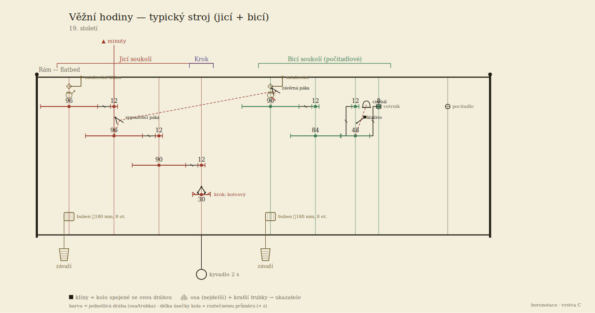
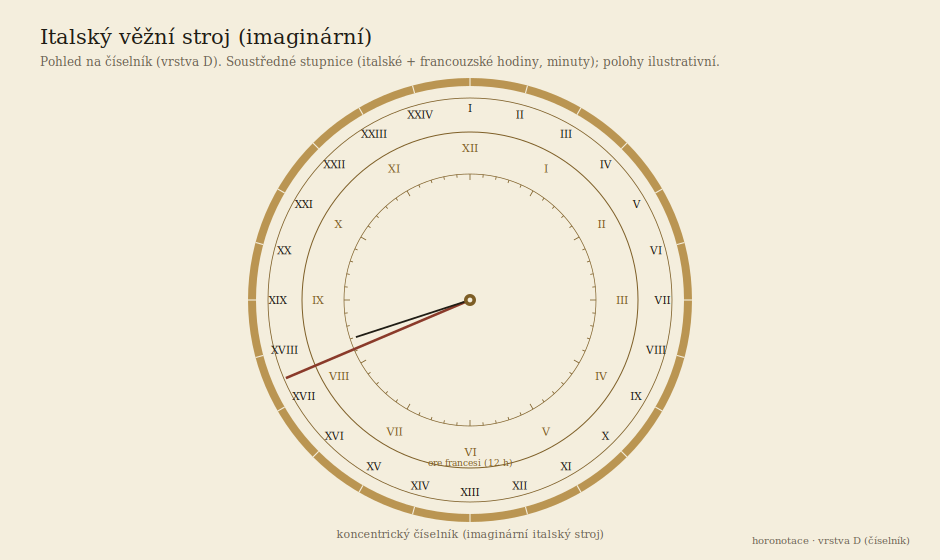
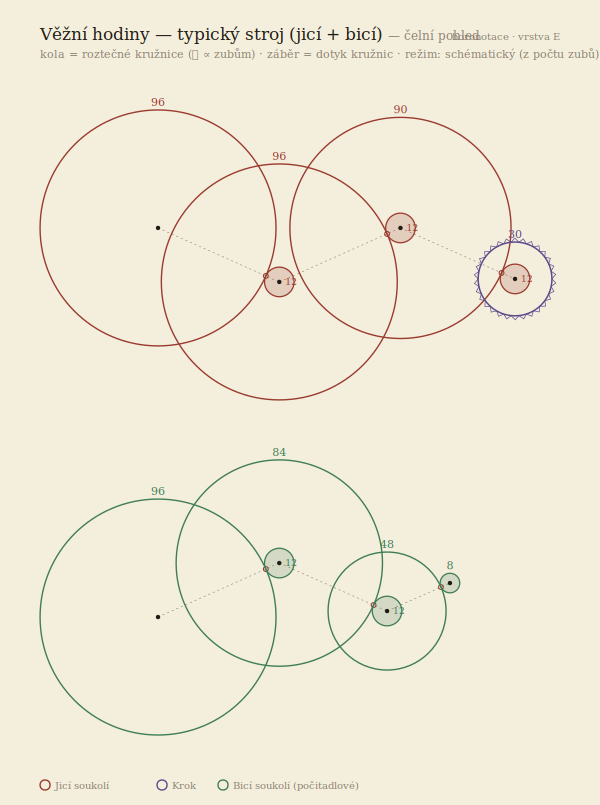
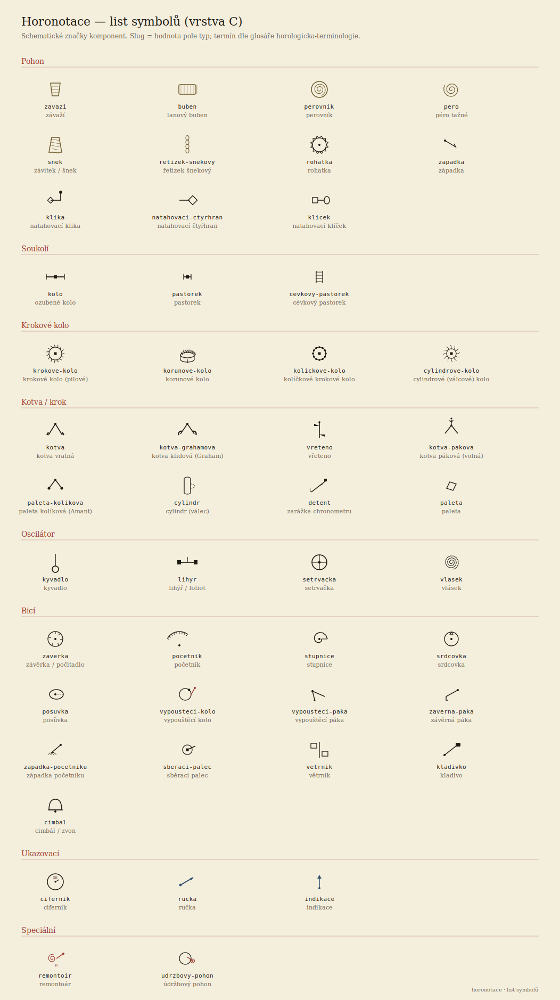
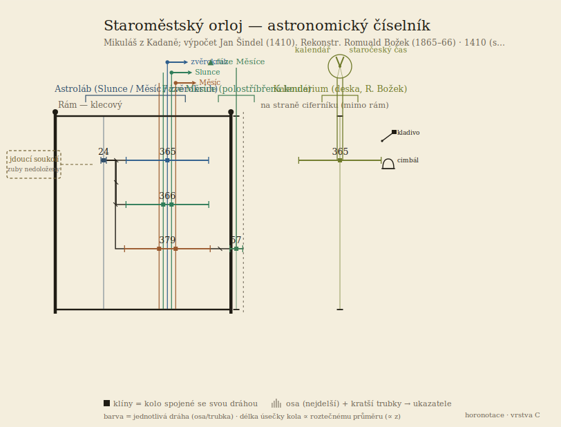

# Horonotace — notace pro popis hodinových strojů

### Specifikace v0.1 · pracovní návrh k připomínkám

| | |
|---|---|
| **Stav** | Návrh (draft) — k odborné oponentuře |
| **Datum** | 22. 6. 2026 |
| **Autor** | David Knespl (Český spolek horologický) |
| **Určeno** | restaurátorům, muzejníkům, hodinářům a badatelům k připomínkám |
| **Kontakt na připomínky** | viz §14 |

---

## 0. Shrnutí pro spěchající

**Horonotace** je navrhovaný způsob, jak **jednotně a strojově čitelně zapsat celý
hodinový stroj** — pohon, soukolí, krok, oscilátor, bicí ústrojí, ukazovací prvky —
tak, aby se z téhož zápisu dal:

1. **vykreslit schématický obrázek** stroje (kinematické schéma) i čelní pohled na ciferník,
2. **spočítat** převod, počet kmitů, případně chyba astronomické indikace,
3. **citovat** v odborném textu a ukládat do databáze sbírek.

Cílem je něco jako „notový zápis" nebo „chemický vzorec" pro hodinové stroje:
jednoznačný, úsporný a sdílitelný popis, který dnes **chybí** (§3).

**Co od vás potřebujeme:** projít zejména **terminologii** (§9), **věrnost popisu
konstrukce** (§5–6) a **rozsah** (§2), a říct, co chybí, co je pojmenované nesprávně a
zda byste takový zápis ve své praxi využili. Konkrétní otázky jsou v §12. Úplnou notaci
(slovník, model, příklad) najdete v §8.

---

## 1. Motivace

Hodinové stroje dnes popisujeme buď **volným textem** (nejednotně, nepřevoditelně na
výpočet), nebo **technickým výkresem** (přesný, ale pracný a nečitelný strojově), nebo
**fotografií** (ukáže stav, ne funkci). Pro evidenci sbírek, restaurátorskou
dokumentaci a srovnávací studium chybí **střední vrstva**: stručný formální popis
*funkce a topologie* stroje — co pohání co, kolik má co zubů, jak se odbíjí, co se
ukazuje.

Inspirací jsou zavedené notace z jiných oborů: **SMILES** v chemii (lineární zápis
molekuly), **PGN** v šachu, **MEI/ABC** v hudbě. Všechny oddělují *podstatu* od
*vykreslení* a jsou čitelné člověkem i strojem (reference §14).

## 2. Rozsah — co notace popisuje a co ne

**Pokrývá** (záměrně): **věžní hodiny** (klecový i flatbed rám), **stolní, nástěnné a
skříňové** interiérové stroje (plotnové), **astronomické hodiny a orloje** (astroláb,
kalendárium, planetární indikace).

**Zatím nepokrývá** (mimo rozsah v0.1): kapesní a náramkové hodinky, čistě
elektrické/quartzové stroje, výrobní/dílenské výkresy (tolerance, materiály, kování).

**Dvě úrovně podrobnosti** — popis nemusí být úplný: **bloková úroveň** (jen funkční
ústrojí a tok mezi nimi, když detaily kol neznáme) a **úroveň kol** (jednotlivá kola a
pastorky s počty zubů). Lze popsat jen to, co je doloženo; nedoložené se nevymýšlí.

## 3. Stav poznání — proč to děláme

Rešerše ukázala, že **formální, strojově čitelná notace pro *celý* hodinový stroj
neexistuje**. Existují jen dílčí prostředky:

- **strojní kinematická schémata** — mezinárodní norma **ISO 3952** definuje grafické
  značky pro kinematická schémata mechanismů; v české strojařské praxi „kinematická
  schémata" (Reuleaux, Artoboleckij — reference §14). Řeší obecné mechanismy, ne
  hodinové ústrojí jako celek (krok, bití, astronomická indikace).
- **horologická literatura** popisuje *jednotlivé* aspekty (vzorce pro počet kmitů,
  katalogy kroků) textem a výkresem, ne jednotným formátem.
- **Ludwig Oechslin** používá ve svých knihách (zejm. *Priestermechaniker*, 1996)
  vlastní **grafickou disciplínu** — „elevaci mezi deskami": vodorovné čáry = desky,
  svislice = hřídel, závorka s číslem = kolo se zuby, vodorovně = záběr, pojmenované
  výstupy = indikace. Není to formalismus, spíš důsledná kreslířská konvence.

Horonotace tuto mezeru zaplňuje: spojuje **strojařské kinematické schéma** (ISO 3952)
s **horologickými glyfy** a Oechslinovou elevací do jednotného, počitatelného formátu.
Podrobnosti: [docs/oechslin-roegel.md](../docs/oechslin-roegel.md),
[docs/reserse-prior-art.md](../docs/reserse-prior-art.md).

## 4. Jak je notace uspořádaná — pět vrstev

Záměrně oddělujeme **podstatu** od **vykreslení**. Z jednoho zdrojového popisu se
generuje vše ostatní.

| Vrstva | Co to je | K čemu | Stav |
|---|---|---|---|
| **A — model** | strukturovaný zápis stroje (textový soubor) | zdroj pravdy; počítá se z něj | hotová v0.1 |
| **B — lineární zápis** | krátký řetězec do textu/citace | psaní rukou, do článku | plán |
| **C — elevace soukolí** | schématický **boční** obrázek stroje | „jak je stroj poskládaný" (axiálně) | prototyp |
| **D — pohled na ciferník** | schématický **čelní** obrázek číselníku | „co a jak se ukazuje" | prototyp |
| **E — čelní pohled na soukolí** | kola jako **roztečné kružnice** | planární uspořádání hřídelí (depthing) | prototyp |

Vrstvy C a E jsou **dvě ortografické projekce téhož stroje** (z boku a zepředu).

Vrstva A je **graf** (síť), ne strom — soukolí a spřažení jdoucího a bicího ústrojí
tvoří smyčky. Restaurátor ani muzejník nemusí psát vrstvu A ručně; cílem je pohodlný
formulář/nástroj. Tato specifikace ji popisuje, aby bylo zřejmé, *co všechno* zápis
zachytí.

## 5. Z čeho se popis skládá

Stroj se skládá z pěti druhů údajů:

- **prvky** — vše hmotné: kola, pastorky, krokové kolo, kotva, kyvadlo, bubny, závaží,
  kladiva, cimbály, ručky, páky… Každý má **typ** (z řízeného slovníku, §8.6) a podle
  typu další pole (kolo má `zuby`, buben má `prumer` a `otacky`).
- **hřídele** — *osy*. Souosé prvky (kolo + pastorek na téže ose) sdílejí hřídel; záběr
  vzniká mezi prvky na **různých** hřídelích. Sem patří i **soustředné trubky** (ručky
  Slunce / Měsíce / zvěrokruhu nad sebou).
- **vazby** — *hrany* mezi prvky: záběr ozubení, pohon, tok pohybu, spouštění bití,
  blokování (zámek), pohon ukazatele.
- **ústrojí** — funkční bloky (pohon, jdoucí soukolí, krok, oscilátor, bicí soukolí,
  ukazovací ústrojí, komplikace).
- **konstrukce** — typ nosné konstrukce: **desky** (plotny), **klecový rám**, **flatbed
  rám**.

> **Důležité rozlišení:** abstraktní síť (prvky–hřídele–vazby) je *nezávislá* na typu
> rámu. Typ konstrukce ovlivňuje **jen prostorové vykreslení**, ne výpočet převodů.
> **Věžní hodiny mají rám** (klecový nebo flatbed), kola jsou uložena v rámových
> sloupcích a příčníkách — **ne mezi plotnami** jako interiérové stroje. Komplikace
> (fáze Měsíce, kalendárium) bývají **na straně ciferníku, mimo rám** — notace to umí
> odlišit.

## 6. Jak číst schéma stroje (vrstva C)

Vrstva C kreslí stroj **z boku** jako kinematické schéma v duchu Oechslinovy elevace:

- **svislá čára = hřídel (osa);** barva odlišuje jednotlivé dráhy / ústrojí.
- **vodorovná úsečka = kolo nebo pastorek;** délka **úměrná počtu zubů**, číslo u
  úsečky = počet zubů.
- **dvě úsečky nad sebou na sousedních hřídelích, které se dotýkají = záběr.**
- **černý čtvereček** na hřídeli = pevné spojení kola s osou.
- **rám** je obdélník kolem soukolí; **čárkovaná dělicí čára** odděluje *stranu
  ciferníku* (komplikace mimo rám).
- **krokové kolo** = úsečka s **pilovými konci** (nebo **tečkami** u kolíčkového
  kroku), nad ním **kotva**, vpravo štítek *krok: <typ>*.
- **regulace bití** (páky) se kreslí **přímo u svého kola** (layout „in-situ");
  **čárkovaná** hrana = spouštění, **tečkovaná se značkou zámku** = blokování.
- **natahování** na natahovacím čepu: **čtyřhran + klika + rohatka se západkou**.
- dole visí **závaží** na laně z **bubnu**; **kyvadlo** je naznačeno pod krokem.

**Příklad — typický věžní stroj** (jicí + bicí, flatbed rám):



Vlevo červené **jicí soukolí** (hnací kolo 96 → minutové 96 → mezitimní 90 → krokové
kolo 30, vteřinové kyvadlo, kotvový krok), vpravo zelené **bicí soukolí** (96 → 84 →
kolíkové 48 → větrník, počitadlo). Páky regulace bití sedí u svých kol; nahoře na obou
hnacích hřídelích natahování klikou. Počty zubů jsou zde **ilustrativní** pro běžný
stroj 19. století, ale převod jicího soukolí dává reálné vteřinové kyvadlo.

## 7. Pohled na ciferník (vrstva D)

Elevace ukáže *mechaniku*, ne to, **jak indikace vypadá zepředu**. Vrstva D kreslí
schématický čelní pohled. Zatím má dvě šablony: **soustředné stupnice** (prsteny hodin,
minut, kalendáře) a **stereografický astroláb** (astronomické hodiny).

**Příklad — imaginární italský věžní stroj, koncentrický číselník:**



Soustředné stupnice: vnější 24 **italských hodin** (I…XXIV od západu Slunce), střední
12 **francouzských hodin**, vnitřní minutová; dlouhá italská ruka + minutová.

**Astroláb (astronomické hodiny).** Pro astronomické hodiny vrstva D konstruuje astroláb
geometricky správně jako **stereografickou projekci**. Pozor na konvenci: pražský orloj
je promítán **ze severního pólu** (na rozdíl od běžného evropského astrolábu z jižního
pólu) — poloměr kružnice deklinace `r(δ) = r_E·tan(45°+δ/2)`, takže **obratník Raka je
vnější (největší), Kozoroha vnitřní**; ekliptika je excentrická kružnice tečná k oběma
obratníkům a horizont i soumrak (−18°) jsou excentrické kružnice pro danou zeměpisnou
šířku. (Konkrétní existující stroj — např. orloj — zde záměrně neuvádíme jako vzorový
číselník; šablona je obecná.)

## 7b. Čelní pohled na soukolí (vrstva E)

Elevace (C) ukazuje *axiální* skládání, ciferník (D) *čelní indikaci*. Třetí projekce —
**čelní pohled na soukolí** — kreslí kola jako **roztečné kružnice** a ukazuje *planární*
uspořádání hřídelí: kde sedí, jak se kola překrývají. Je to obdoba restaurátorského
**depthing plánu**. Čte se takto:

- **kružnice = kolo** (poloměr ∝ počtu zubů); **soustředná kola sdílejí střed** (hřídel/osa) —
  u astronomických hodin se tak astroláb přirozeně jeví jako soustředné prstence,
- **dotyk dvou kružnic = záběr** (čárkovaná spojnice = osa záběru, kroužek = bod záběru),
- **krokové kolo** má pilový obvod; **pastorek** je malý plný kroužek; **• = hřídel**.

Dva režimy:

- **schématický** (bez nových dat) — polohy hřídelí se dopočtou z počtů zubů (konstantní
  modul; samostatné stroje, např. jicí a bicí, se kreslí pod sebou),
- **věrný (depthing plán)** — když každá ozubená hřídel má pole `poloha: [x, y]` (mm),
  kreslí se podle skutečných změřených poloh.

**Příklad — věžní stroj (jicí soukolí nahoře, bicí dole):**



Prototyp: `tools/render_front.py`.

---

## 8. Kompletní notace

Tato kapitola obsahuje **úplný zápis notace**: strukturu souboru, slovník a kompletní
příklad. Formát je textový (YAML), validovaný proti JSON Schema ([schema/](../schema/)).

### 8.1 Struktura souboru

```yaml
horonotace: "0.1"
hlavicka:  { … }     # metadata, citace (§8.2)
stroj:
  konstrukce: { … }  # typ nosné konstrukce
  ustroji: [ … ]     # úroveň 1: funkční bloky
  prvky:   [ … ]     # úroveň 2: kola, pastorky, krok, kyvadlo, cimbály, ručky…
  hridele: [ … ]     # sdílené osy (souosé prvky)
  vazby:   [ … ]     # hrany: záběr, tok, spouštění, blokování, pohon, pohání
```

### 8.2 Hlavička (citace)

```yaml
hlavicka:
  nazev: "Věžní hodiny, kostel sv. …"
  autor: "Jan Prokeš ze Sobotky"   # výrobce / firma
  misto: "Sobotka"
  datace: "1868"                    # rok nebo rozsah „1860–1870"
  typ: vezni                        # vezni|stolni|nastenne|skrinove|astronomicke|orloj|jine
  inv: "H-1234"                     # inventární číslo
  sbirka: "Hodinárium ČSH"
  wikidata: Q729370                 # volitelně (plán: i CIDOC-CRM)
  pozn: "…"
```

### 8.3 Prvek (`prvky[]`)

Vše hmotné je typovaný prvek. Společná pole `id`, `typ`; další pole závisí na typu
(model je rozšiřitelný).

```yaml
- id: stredni-kolo
  typ: kolo
  role: minutove       # funkční role (volitelně)
  ustroji: jdouci      # příslušnost k bloku úrovně 1
  zuby: 96             # u kol/pastorků
  pozn: "nese minutovou ručku"
```

### 8.4 Hřídel (`hridele[]`) — sdílená osa

```yaml
- id: h-stredni
  nese: [p-stredni, stredni-kolo]  # kola/pastorky na téže ose
  perioda: "1 h"                   # doba 1 otáčky (volitelně)
- id: h-slunce
  osa: os-astrolab                 # soustředné trubky (Stützrohr) na společné ose →
  nese: [kolo-slunce, rucka-slunce] #   vrstva C je kreslí v jednom sloupci nad sebou
  poloha: [0, 0]                   # volitelně: skutečná poloha v plotně [x, y] v mm →
                                   #   čelní pohled (vrstva E) ji použije pro věrný depthing plán
```

### 8.5 Vazby (`vazby[]`) — hrany

```yaml
- { typ: zaber, z: stredni-kolo, do: p-treti }   # převod = zuby(z)/zuby(do)
```

| `typ` | Význam | `z` → `do` |
|---|---|---|
| `pohon` | pohon roztáčí první kolo | pohon → kolo |
| `zaber` | záběr ozubení | hnací → hnaný (kolo i pastorek) |
| `tok` | tok síly/pohybu mezi ústrojími (úroveň 1) | ústrojí → ústrojí |
| `spousteni` | jdoucí soukolí spouští bicí; páka uvolní páku (let-off / aktuace) | prvek/ústrojí → prvek/ústrojí |
| `blokuje` | člen zamyká/blokuje druhý (zámek bicího stroje, západka) | páka/kolo → soukolí/prvek |
| `pohani` | soukolí pohání ukazovací prvek | prvek → rucka/indikace |

### 8.6 Úplný řízený slovník

Hodnoty `typ`/`role`/`druh` jsou **ukotvené na hodinářský glosář** (prameny §14).
Slug je ASCII bez diakritiky; český termín je preferovaný tvar z glosáře.

**Pohon a natahování**

| `typ` | cs | en | de |
|---|---|---|---|
| `zavazi` | závaží | weight | Gewicht |
| `buben` | lanový buben (`prumer`,`otacky`,`lano`) | drum | Trommel |
| `pero` | péro tažné | mainspring | Zugfeder |
| `perovnik` | perovník | mainspring barrel | Federhaus |
| `snek` / `zavitek` | závitek / šnek | fusee | Schnecke |
| `retizek-snekovy` | řetízek šnekový | fusee chain | Schneckenkette |
| `rohatka` | rohatka | ratchet wheel | Sperrad |
| `zapadka` | západka | pawl / click | Sperrklinke |
| `klika` | natahovací klika | winding crank | Aufzugskurbel |
| `natahovaci-ctyrhran` | natahovací čtyřhran | winding square | Aufzugsvierkant |
| `klicek` | natahovací klíček | winding key | Aufzugschlüssel |

**Soukolí** — `kolo` (+ `role`), `pastorek`, `cevkovy-pastorek`

| `role` (u `kolo`) | cs | en | de |
|---|---|---|---|
| `hlavni` | hlavní / hnací kolo | great wheel | Grundrad |
| `spodni` | kolo spodní / hřídelové | barrel wheel | Federhausrad |
| `minutove` | kolo minutové | center wheel | Minutenrad |
| `mezitimni` | kolo mezitimní | third wheel | Zwischenrad |
| `sekundove` | kolo sekundové | fourth wheel | Sekundenrad |
| `kolickove` | kolíčkové kolo | pin wheel | Stiftenrad |
| `stridne` | kolo střídné | minute wheel | Wechselrad |
| `hodinove` | kolo hodinové | hour wheel | Stundenrad |

| `typ` | cs | en | de |
|---|---|---|---|
| `pastorek` | pastorek (`zuby` = počet listů) | pinion | Trieb |
| `cevkovy-pastorek` | cévkový pastorek | lantern pinion | Laternengetriebe |

**Krok** — `krok` s polem `druh` (typ kroku, tabulka níže). Krok se skládá z
**komponentních symbolů** — typů krokových kol a typů kotev (mapování druh → komponenty
viz [docs/kroky.md](../docs/kroky.md)):

- krokové kolo: `krokove-kolo` (pilové), `korunove-kolo` (crown — vřetenový krok),
  `kolickove-kolo` (kolíkové — Amant), `cylindrove-kolo`;
- kotva / člen: `kotva` (vratná), `kotva-grahamova` (klidová), `vreteno`, `kotva-pakova`
  (páková), `paleta-kolikova`, `cylindr`, `detent`, `paleta`.

| `druh` | cs | en | de |
|---|---|---|---|
| `vretenovy` | vřetenový krok | verge | Spindelhemmung |
| `kotvovy` | kotvový (vratný) krok | anchor / recoil | Ankerhemmung |
| `grahamuv` | Grahamův krok | deadbeat | ruhende Hemmung |
| `amantuv` | Amantův krok | pin-pallet (Amant) | Stiftenhemmung |
| `robertuv` | Robertův krok | Robert | älterer Stiftengang |
| `brocotuv` | Brocotův krok | Brocot | Brocot-Hemmung |
| `valeckovy` | válečkový / cylindrový | cylinder | Zylinderhemmung |
| `chronometrovy` | chronometrový krok | chronometer / detent | Chronometerhemmung |
| `volny-kotvovy` | volný kotvový (pákový) | lever | Ankerhemmung (frei) |
| `hippuv` | Hippův přerušovač | Hipp toggle | Hipp-Hemmung |

**Oscilátor**

| `typ` | cs | en | de |
|---|---|---|---|
| `kyvadlo` | kyvadlo (`perioda`, `kompenzace`: `rostove`/`rtutove`/`invarove`) | pendulum | Pendel |
| `lihyr` / `foliot` | lihýř / foliot | foliot | Waag |
| `setrvacka` | setrvačka | balance | Unruhe |
| `vlasek` | vlásek | hairspring | Spirale |

**Bicí soukolí a regulace** — dva systémy: počitadlové (závěrkové) a rack-and-snail.
Dokumentace [docs/bici-regulace.md](../docs/bici-regulace.md).

| `typ` | cs | en | de |
|---|---|---|---|
| `zaverka` | závěrka (počítací kolo) | locking plate | Schloßscheibe |
| `pocitadlo` | počitadlo | count wheel | Zählrad |
| `pocetnik` | početník (rack) | rack | Schlagrechen |
| `stupnice` | stupnice (snail) | snail | Staffel |
| `srdcovka` | srdcovka | warning / hoop wheel | Herzscheibe |
| `posuvka` | posůvka | lifting cam | Hebenocke |
| `vypousteci-kolo` | vypouštěcí kolo | let-off | Auslösung |
| `vypousteci-paka` | vypouštěcí páka | lifting piece | Auslösehebel |
| `zaverna-paka` | závěrná páka | locking lever | Sperrhebel |
| `zapadka-pocetniku` | západka početníku | rack hook | Rechenfanghebel |
| `sberaci-palec` | sběrací palec | gathering pallet | Hebedaumen |
| `vetrnik` | větrník | fly / fan | Windfang |
| `kladivko` | kladivo | hammer | Hammer |
| `cimbal` / `zvon` | cimbál / zvon (`pocet`) | bell / gong | Glocke |

**Ukazovací ústrojí a indikace**

| `typ` | cs | en | de |
|---|---|---|---|
| `cifernik` | ciferník | dial | Zifferblatt |
| `rucka` | ručka (`ukazuje`: `hodiny`/`minuty`/`vteriny`/`datum`/`mesic`/…) | hand | Zeiger |
| `soukoli-rucek` | kvadratura (převod ručiček) | motion work | Wechselgetriebe |
| `indikace` | indikace (`druh`: `kalendar`/`lunace`/`faze-mesice`/`equation`/`astrolab`/`tellurium`/`planetarium`) | indication | Anzeige |

**Konstrukce** (`stroj.konstrukce.typ`)

| `typ` | cs | en | de |
|---|---|---|---|
| `desky` | plotny / desky | plates | Platinen |
| `klecovy-ram` | klecový rám | birdcage / posted frame | Vogelkäfig-Gestell |
| `flatbed-ram` | flatbed rám | flatbed frame | Flachbett-Gestell |

### 8.7 Kompletní příklad — jednoduchý závažový stroj s krokem

Minimální, ale úplný zápis: závažový pohon s bubnem a natahováním, jicí soukolí,
kotvový krok, vteřinové kyvadlo, minutová a hodinová ručka.

```yaml
horonotace: "0.1"
hlavicka:
  nazev: "Ukázkový jicí stroj"
  typ: nastenne
  datace: "ilustrativní"
stroj:
  konstrukce: { typ: desky, material: "mosaz" }
  ustroji:
    - { id: pohon,     typ: pohon,         nazev: "Závažový pohon" }
    - { id: jdouci,    typ: soukoli-jdouci, nazev: "Jicí soukolí" }
    - { id: krok,      typ: krok,          nazev: "Krok" }
    - { id: oscilator, typ: oscilator,     nazev: "Kyvadlo" }
    - { id: ukazovaci, typ: ukazovaci,     nazev: "Ručky" }
  prvky:
    - { id: zavazi, typ: zavazi, ustroji: pohon }
    - { id: buben,  typ: buben,  ustroji: pohon, prumer: "40 mm", otacky: 6, lano: "struna" }
    - { id: hlavni-kolo, typ: kolo, role: hlavni,   ustroji: jdouci, zuby: 96 }
    - { id: p-stredni,   typ: pastorek,             ustroji: jdouci, zuby: 12 }
    - { id: stredni-kolo, typ: kolo, role: minutove, ustroji: jdouci, zuby: 90 }
    - { id: p-krokove,   typ: pastorek,             ustroji: jdouci, zuby: 12 }
    - { id: krokove-kolo, typ: krokove-kolo, ustroji: krok, zuby: 30 }
    - { id: kotva,    typ: kotva,  ustroji: krok }
    - { id: krok-typ, typ: krok,   druh: kotvovy, ustroji: krok }
    - { id: kyvadlo,  typ: kyvadlo, ustroji: oscilator, perioda: "2 s" }
    - { id: rucka-m,  typ: rucka, ukazuje: minuty,  ustroji: ukazovaci }
    - { id: rucka-h,  typ: rucka, ukazuje: hodiny,  ustroji: ukazovaci }
    - { id: kvadratura, typ: soukoli-rucek, ustroji: ukazovaci }
  hridele:
    - { id: h-barrel,  nese: [buben, hlavni-kolo], perioda: "6 h" }
    - { id: h-stredni, nese: [p-stredni, stredni-kolo], perioda: "1 h" }
    - { id: h-krokove, nese: [p-krokove, krokove-kolo, kotva] }
  vazby:
    - { typ: pohon, z: zavazi, do: buben }
    - { typ: zaber, z: hlavni-kolo, do: p-stredni }   # 96/12 = 8
    - { typ: zaber, z: stredni-kolo, do: p-krokove }  # 90/12 = 7,5
    - { typ: tok,    z: jdouci, do: krok }
    - { typ: tok,    z: krok,   do: oscilator }
    - { typ: pohani, z: stredni-kolo, do: rucka-m }
    - { typ: pohani, z: kvadratura,   do: rucka-h }
```

Z tohoto zápisu se spočítá převod i počet kmitů (§11), vykreslí elevace (vrstva C) i
ručky (vrstva D). Spustitelná podoba: [examples/ukazka-jednoduchy.yaml](../examples/ukazka-jednoduchy.yaml)
→ [render/ukazka-jednoduchy.svg](../render/ukazka-jednoduchy.svg). Větší, doložené
příklady viz §10 a [examples/](../examples/).

---

## 9. Katalog komponent (symboly)

Ke každému typu existuje schématický **symbol**. Úplný list (48 symbolů):



Krok se ve schématech **neskládá ze samostatných obrázků každého typu**, ale z
komponentních symbolů — **typů krokových kol** (pilové `krokove-kolo`, korunové
`korunove-kolo` pro vřetenový krok s lihýřem, kolíčkové `kolickove-kolo` pro Amantův
krok, cylindrové) a **typů kotev** (vratná, klidová Graham, vřeteno, páková, kolíková
paleta, cylindr, detent). Mapování `druh` → komponenty viz [docs/kroky.md](../docs/kroky.md).

Dokumentace: [docs/symboly.md](../docs/symboly.md), [docs/kroky.md](../docs/kroky.md),
[docs/bici-regulace.md](../docs/bici-regulace.md).

## 10. Podrobný příklad — soukolí Staroměstského orloje

Jako reálný příklad **soukolí** (zejm. soustředných trubek astrolábu) je zapsán
pražský orloj z doložených pramenů (§14); jeho číselník zde jako vzorový neuvádíme
(viz §7):

- **astroláb** — společný pastorek 24 zubů pohání soustředné kruhy **365 / 366 / 379**
  (zvěrokruh / Slunce / Měsíc),
- **fáze Měsíce** — věnec 57 zubů,
- **kalendárium** — kolo 365 zubů,
- **kovaný klecový rám**; fáze a kalendárium jsou na straně ciferníku, mimo rám.

Elevace (vrstva C):



Zápis: [examples/praga-orloj.yaml](../examples/praga-orloj.yaml). Počty zubů *jdoucího*
soukolí orloje nejsou ve veřejných pramenech jednoznačně doloženy — v zápisu jsou
označeny jako **nedoložené** a nevymýšlíme je.

Historickou variantu (stav 16. století, čtyři „strany" podle Táborského *Zprávy o orloji*
1570 a Listu purkmistra 1410) zachycuje
[examples/praga-orloj-taborsky.yaml](../examples/praga-orloj-taborsky.yaml) — ukázka, jak
notace unese i zápis podle archivního pramene, kde autor počty zubů většinou neuvádí.

## 11. Co se z modelu spočítá

- **celkový převod** soukolí = součin poměrů zubů po cestě záběrů
  (`i = (Z₁/z₁)(Z₂/z₂)…`),
- **počet kmitů za hodinu** oscilátoru z převodu mezi minutovým a krokovým kolem a
  počtu zubů krokového kola,
- **délka chodu / čas** z průměru bubnu, počtu otáček a dráhy závaží,
- **astronomické poměry a chyba** — periody se ukládají jako **přesné zlomky** se
  smyslem otáčení; u indikace volitelně cílová astronomická perioda a dopočtený
  **drift** (po vzoru Oechslinovy dokumentační praxe, §14).

## 12. Otázky k připomínkám

Prosíme zejména o názor na:

1. **Terminologie** — jsou české termíny správné a v souladu s vaší praxí? Co je
   pojmenované špatně? (zejm. §8.6: regulace bití, natahování)
2. **Věrnost konstrukce** — vystihuje rozlišení *desky / klecový rám / flatbed rám* a
   *strana ciferníku mimo rám* realitu věžních i interiérových strojů?
3. **Rozsah** — chybí celá skupina komponent (repetice, hrací stroj, automatické
   figury, rovnice času, sekundové zastavení…)?
4. **Granularita** — je dvojí úroveň (blok / kola) dost, nebo potřebujete jemnější
   (čepy, ložiska, materiály) pro restaurátorskou dokumentaci?
5. **Čitelnost schématu** (vrstva C) — je elevace srozumitelná? Co byste kreslili jinak?
6. **Využití** — dovedete si představit nasazení pro evidenci sbírky, restaurátorskou
   zprávu nebo srovnávací studii? Co by muselo přibýt?
7. **Identifikace stroje** — jaké údaje v hlavičce (výrobce, datace, inv. č., sbírka,
   lokace) jsou nezbytné?

## 13. Jak připomínkovat

Připomínky prosím k jednotlivým bodům s odkazem na číslo kapitoly, ideálně s příkladem
z konkrétního stroje (i fotka/náčrt pomůže); terminologické s uvedením pramene nebo
regionálního úzu.

Kanály pro připomínky:

- **GitHub Issues**: <https://github.com/csh-cz/horonotace/issues> (preferováno — u každé
  připomínky číslo kapitoly),
- kontakt: David Knespl, Český spolek horologický.

Zdrojový repozitář (model, schéma, příklady, renderery): <https://github.com/csh-cz/horonotace>.

## 14. Reference

### Inspirace — notace v jiných oborech

- Weininger, D. (1988): *SMILES, a Chemical Language and Information System.* Journal of
  Chemical Information and Computer Sciences 28(1), 31–36.
- *Portable Game Notation (PGN)* — Edwards, S. J. (1994): Standard specifikace zápisu
  šachových partií.
- *Music Encoding Initiative (MEI)*, music-encoding.org; *ABC notation* (Chris Walshaw).

### Strojní kinematická schémata (klasické)

- **ISO 3952-1 až -4**: *Kinematic diagrams — Graphical symbols* (1. vyd. 1981).
  Mezinárodní norma grafických značek pro kinematická schémata mechanismů.
- Reuleaux, F. (1875): *Theoretische Kinematik. Grundzüge einer Theorie des
  Maschinenwesens.* Vieweg, Braunschweig.
- Artoboleckij, I. I. (1975–1980): *Mechanisms in Modern Engineering Design.* Mir,
  Moskva (katalog kinematických schémat mechanismů).

### Grafická elevace soukolí — hlavní inspirace

- **Oechslin, L. (1996): *Astronomische Uhren und Welt-Modelle der Priestermechaniker
  im 18. Jahrhundert.*** — vzor „elevace mezi deskami" (svislice = hřídel, závorka =
  kolo se zuby, vodorovně = záběr, pojmenované výstupy = indikace). Hlavní inspirace pro
  vrstvu C. Interní rozbor: [docs/oechslin-roegel.md](../docs/oechslin-roegel.md).

### Horologická terminologie a konstrukce (česká a německá)

- Špatný, F. (1882): *Německo-český slovník pro hodináře a pouzdráře hodinářské.*
  (digitální kopie MZK)
- Sušický, V. R. (1900): *Hodinářství. Pro praktickou potřebu hodinářů a škol odborných.*
- Sladkovský, J. (1947): *Učebnice odborné nauky hodinářské.* (zejm. bicí soukolí)
- Hajn, M. (1953): *Základy jemné mechaniky a hodinářství.*
- Martínek, Z. & Řehoř, J. (1964): *Základy hodinářství.* (vzor blokové granularity)
- Dietzschold, C. (1905): *Die Hemmungen der Uhren.* archive.org (kroky / Hemmungen)
- Další period prameny v glosáři skillu `horologicka-terminologie`: Saunier (1887),
  Gros (1913), Šumavský (1851).

### Pražský orloj (příklad §10)

- Horský, Z. & Procházka, E. (1964): *Pražský orloj* (počty zubů astrolábu).
- orloj.eu — popis soukolí a indikací.

### Metadatové standardy (plán, v0.2)

- Getty AAT (Art & Architecture Thesaurus), Wikidata, CIDOC-CRM — mapování slovníku a
  hlavičky pro muzejní evidenci.

---

*Tento dokument je pracovní návrh verze 0.1 a bude se podle připomínek měnit. Děkujeme
za čas věnovaný oponentuře.*
